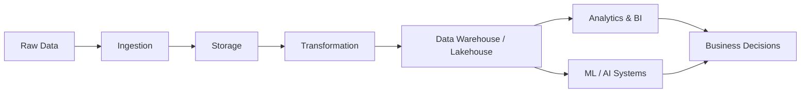

<div align="center">


# Hi, I'm Ritik 👋

### Data Engineering • AI/ML • Analytics


<p>
  <a href="https://github.com/Ritik574-coder"></a>
  <a href="https://www.linkedin.com/in/ritik-kumar-b81b32375/"></a>
  <a href="https://public.tableau.com/app/profile/ritik.sky"></a>
</p>

</div>

---

## 🧑‍💻 About Me

I’m a self-learning **Data Engineering learner from India**, focused on building strong foundations in data systems, analytics, cloud technologies, and modern AI/ML workflows.

My current direction is to become a strong **Data Engineer / Data & AI Engineer** by combining software engineering fundamentals with practical data-platform projects.

- 🔭 Building hands-on **ETL/ELT, data warehouse and cloud data projects**
- 🧱 Learning **data modeling, dimensional modeling, normalization and pipeline architecture**
- ⚙️ Working with **Python, SQL, Spark, dbt, Airflow and Snowflake**
- ☁️ Exploring **AWS, Azure and GCP** data services
- 🤖 Expanding toward **Machine Learning and AI Engineering**
- 📚 Learning by building, documenting and improving real projects

---

## 🧰 Data & AI Engineering Stack

<div align="center">

### Languages & Analytics


### Data Engineering


 &nbsp;
 &nbsp;
 &nbsp;


### Cloud & Data Platforms


 &nbsp;
 &nbsp;


### AI / ML & Developer Tools


</div>

---

## 🚀 Featured Projects

| Project | Focus | Technologies |
|---|---|---|
| **[Snowflake Data Engineering Project](https://github.com/Ritik574-coder/Snowflake-Data-Engineering-Project)** | Warehouse + ETL/ELT + data modeling | Snowflake · SQL · Python |
| **[AWS Data Engineering Lab](https://github.com/Ritik574-coder/aws-data-engineering-lab)** | Cloud data engineering experiments | AWS · Python · SQL |
| **[Medallion Data Warehouse](https://github.com/Ritik574-coder/Medallion-Data-Warehouse)** | Layered warehouse architecture | SQL · Data Warehousing |
| **[SQL Server Data Warehouse](https://github.com/Ritik574-coder/sqlserver-datawarehouse)** | Data warehouse implementation | SQL Server · ETL |
| **[dbt Analytics Engineering](https://github.com/Ritik574-coder/dbt-analytics-engineering)** | Transformation + analytics engineering | dbt · SQL |
| **[Business Intelligence Dashboard](https://github.com/Ritik574-coder/Business-Intelligence-Analytics-Dashboard)** | BI and analytical reporting | Tableau · SQL · Analytics |

> **Portfolio strategy:** these projects are intentionally centered around data engineering, warehousing, analytics engineering and cloud workflows rather than generic demo applications.

---

## 📊 GitHub Analytics

<div align="center">


<br/>


<br/>


</div>

---

## 🐍 Contribution Activity

<div align="center">


</div>

---

## 🌌 3D Contribution Graph

<div align="center">


<sub>Live contribution visualization — regenerated automatically with GitHub Actions.</sub>

</div>

---

## 📈 My Engineering Focus

```text
Data Engineering     ████████████████████  Core focus
SQL & Data Modeling   ███████████████████░  Strong foundation
Python                ██████████████████░░  Building depth
Cloud Data Platforms  ███████████████░░░░░  Expanding
Spark / Distributed   █████████████░░░░░░░  Developing
AI / ML Engineering   ███████████░░░░░░░░░  Growing
```

> This is a learning roadmap, not a claim of production-level expertise in every listed technology.

---

## 🏗️ What I'm Building Toward


```mermaid
graph LR
    A[Raw Data] --> B[Ingestion]
    B --> C[Storage]
    C --> D[Transformation]
    D --> E[Data Warehouse / Lakehouse]
    E --> F[Analytics & BI]
    E --> G[ML / AI Systems]
    F --> H[Business Decisions]
    G --> H
```

**Goal:** understand the complete path from **data ingestion → reliable pipelines → modeling → analytics → AI/ML consumption**.

---

## 🎯 Current Learning Priorities

| Area | Current Direction |
|---|---|
| **Data Engineering** | ETL/ELT, orchestration, batch processing, data quality |
| **Warehousing** | Dimensional modeling, normalization, Snowflake, SQL Server |
| **Analytics Engineering** | dbt, SQL transformations, testing, documentation |
| **Cloud** | AWS, Azure, GCP data services |
| **Big Data** | Spark, Kafka and distributed processing concepts |
| **AI/ML** | Machine learning foundations and AI engineering workflows |

---

## 🤝 Let's Connect

<div align="center">

<a href="https://www.linkedin.com/in/ritik-kumar-b81b32375/"></a>
<a href="mailto:ritsky@zohomail.in"></a>
<a href="https://public.tableau.com/app/profile/ritik.sky"></a>
<a href="https://x.com/KarlX279873"></a>

<br/><br/>


</div>

---

<div align="center">

### Thanks for visiting! 🚀


</div>
