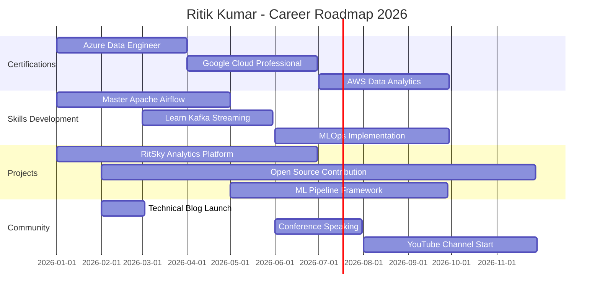

<h1 align="center">
  
</h1>

<div align="center">
  
</div>

<br>

<div align="center">
  <a href="https://www.linkedin.com/in/ritik-kumar-b81b32375/"></a>
  <a href="https://public.tableau.com/app/profile/ritik.sky"></a>
  <a href="https://x.com/KarlX279873"></a>
  <a href="https://www.instagram.com/ritik_sky1/?__pwa=1"></a>
  <a href="mailto:ritsky@zohomail.in"></a>
</div>

<div align="center">
  
  
  
</div>

<br>


---

## 🎯 Professional Summary

```python
class RitikKumar:
    def __init__(self):
        self.role = "Aspiring Data Engineer & AI Innovator"
        self.location = "📍 Patna, Bihar, India"
        self.company = "RitSky Global (Founder & CEO)"
        self.experience = "2+ years in data analytics & engineering"
        self.education = "Data Engineering Student"
        
    def current_focus(self):
        return {
            "learning": ["Azure Data Engineering", "Apache Airflow", "PyTorch", "Databricks"],
            "building": ["Scalable ETL Pipelines", "Real-time Analytics Dashboards", "AI-Powered Export Tools"],
            "exploring": ["MLOps", "Data Mesh Architecture", "Streaming Analytics with Kafka"],
            "certifying": ["Microsoft Azure Data Engineer Associate", "Google Cloud Professional Data Engineer"]
        }
    
    def expertise(self):
        return {
            "data_engineering": ["ETL/ELT", "Data Warehousing", "Pipeline Orchestration", "Data Modeling"],
            "analytics": ["Power BI", "Tableau", "DAX", "Advanced SQL", "Statistical Analysis"],
            "programming": ["Python (Pandas, NumPy)", "SQL/T-SQL", "PySpark", "JavaScript"],
            "cloud_platforms": ["Azure (Synapse, Data Factory)", "AWS (Redshift, Glue)", "Databricks"],
            "databases": ["PostgreSQL", "SQL Server", "MongoDB", "Snowflake (learning)"],
            "tools": ["Git", "Docker", "Jupyter", "VS Code", "Azure DevOps"]
        }
    
    def vision(self):
        return """
        Empowering global businesses through data-driven insights and 
        AI-powered solutions. Building bridges between raw data and 
        strategic decision-making while democratizing access to 
        advanced analytics tools for emerging markets.
        """

# Initialize
ritik = RitikKumar()
print(f"🚀 Mission: {ritik.vision()}")
```

---

## 🌟 About Me

I'm **Ritik Kumar**, a passionate **Data Engineering student** and the **Founder of RitSky Global**, based in **Patna, India**. With over **2 years** of hands-on experience in coding, data visualization, and analytics, I specialize in transforming complex datasets into actionable business intelligence.

### 🎓 My Journey

From late-night debugging sessions to architecting enterprise-grade ETL pipelines, my journey has been fueled by curiosity and a relentless drive to solve real-world problems through data. I've built my expertise through:

- **Academic Excellence**: Rigorous coursework in data structures, algorithms, database systems, and machine learning
- **Practical Experience**: Developed 20+ repositories covering everything from foundational Python to advanced data warehousing
- **Entrepreneurial Spirit**: Founded RitSky Global to deliver AI-powered export analytics and data solutions
- **Continuous Learning**: Completed multiple certifications and courses in cloud computing, BI tools, and data engineering

### 💡 What Drives Me

<table>
<tr>
<td width="50%">

#### 🔥 Current Projects
- Building production-ready ETL pipelines with Airflow
- Developing interactive Power BI dashboards for export analytics
- Creating open-source Python libraries for data transformation
- Implementing ML models for predictive business insights

</td>
<td width="50%">

#### 🎯 2026 Goals
- ✅ Obtain Azure Data Engineer Associate certification
- ✅ Contribute to 5+ major open-source data projects
- ✅ Launch RitSky Global's flagship analytics platform
- ✅ Publish technical blog series on Medium/Dev.to
- ✅ Mentor 10+ aspiring data engineers

</td>
</tr>
</table>

### 🌈 Philosophy & Values

> **"Data isn't just numbers—it's the language of modern innovation. My mission is to make this language accessible, ethical, and transformative for everyone."**

I prioritize:
- **🔒 Data Ethics**: Privacy-first approach and responsible AI practices
- **🌍 Open Source**: Giving back to the community that taught me
- **📚 Continuous Learning**: Staying ahead in a rapidly evolving field
- **🤝 Collaboration**: Building solutions together, not in silos
- **♻️ Sustainability**: Writing efficient, maintainable code that scales

<details>
<summary><b>🎭 Beyond the Code</b></summary>
<br>

When I'm not wrangling data or optimizing queries, you'll find me:

- 🎵 Analyzing Spotify trends and building music recommendation systems
- 📖 Reading about the latest in distributed systems and cloud architecture
- 🎮 Exploring game theory and applying it to business strategy
- ✍️ Writing technical articles and creating educational content
- 🌱 Contributing to environmental data projects and sustainability initiatives
- 🏃 Running, meditating, and maintaining work-life balance

**Fun Fact**: I once built a data pipeline that analyzes cricket statistics in real-time during IPL matches—because cricket + data = ❤️

</details>

---


## 📊 GitHub Analytics & Performance Metrics

<div align="center">
  
### 📈 Overall Statistics


</div>

<div align="center">
  
### 🏆 Key Metrics Dashboard

<table>
<tr>
<td width="50%">


</td>
<td width="50%">


</td>
</tr>
</table>

</div>

<div align="center">

### 💻 Language Distribution & Activity

<table>
<tr>
<td width="50%">


</td>
<td width="50%">


</td>
</tr>
</table>

</div>

<div align="center">

### 🎖️ Achievement Showcase


</div>

<div align="center">

### 📉 Contribution Graph


</div>

<div align="center">

### 📅 Commit Heatmap


</div>

---

## 🛠️ Technology Stack & Expertise

<div align="center">

### 💾 Core Technologies

</div>

#### Programming Languages

<div align="center">


</div>

#### Data Engineering & ETL

<div align="center">


</div>

#### Databases & Data Warehouses

<div align="center">


</div>

#### Cloud Platforms & Services

<div align="center">


</div>

#### Analytics & Business Intelligence

<div align="center">


</div>

#### Machine Learning & AI

<div align="center">


</div>

#### DevOps & Tools

<div align="center">


</div>

#### Visualization & Reporting

<div align="center">


</div>

---

### 📊 Proficiency Matrix

<table>
<thead>
<tr>
<th>Category</th>
<th>Technologies</th>
<th>Proficiency Level</th>
<th>Experience</th>
</tr>
</thead>
<tbody>
<tr>
<td><b>Programming</b></td>
<td>Python, SQL/T-SQL</td>
<td>⭐⭐⭐⭐⭐ Advanced</td>
<td>2+ years</td>
</tr>
<tr>
<td><b>Data Engineering</b></td>
<td>ETL Pipelines, Airflow, Spark</td>
<td>⭐⭐⭐⭐ Intermediate-Advanced</td>
<td>1.5+ years</td>
</tr>
<tr>
<td><b>Cloud Platforms</b></td>
<td>Azure, AWS, Databricks</td>
<td>⭐⭐⭐⭐ Intermediate</td>
<td>1+ year</td>
</tr>
<tr>
<td><b>BI & Analytics</b></td>
<td>Power BI, Tableau, DAX</td>
<td>⭐⭐⭐⭐⭐ Advanced</td>
<td>2+ years</td>
</tr>
<tr>
<td><b>Databases</b></td>
<td>PostgreSQL, SQL Server, MongoDB</td>
<td>⭐⭐⭐⭐ Intermediate-Advanced</td>
<td>2+ years</td>
</tr>
<tr>
<td><b>Machine Learning</b></td>
<td>PyTorch, Scikit-learn, NLP</td>
<td>⭐⭐⭐ Intermediate</td>
<td>8+ months</td>
</tr>
<tr>
<td><b>DevOps</b></td>
<td>Git, Docker, CI/CD</td>
<td>⭐⭐⭐ Intermediate</td>
<td>1+ year</td>
</tr>
<tr>
<td><b>Web Development</b></td>
<td>JavaScript, TypeScript, HTML/CSS</td>
<td>⭐⭐ Beginner-Intermediate</td>
<td>6+ months</td>
</tr>
</tbody>
</table>

<div align="center">

### 🎓 Certifications & Learning Path

| Certification | Status | Provider | Completion Date |
|--------------|--------|----------|-----------------|
| Azure Data Engineer Associate | 🎯 In Progress | Microsoft | Target: Q1 2026 |
| Google Cloud Professional Data Engineer | 📚 Planned | Google | Target: Q2 2026 |
| AWS Certified Data Analytics | 📚 Planned | Amazon | Target: Q3 2026 |
| Databricks Certified Associate Developer | 🎯 In Progress | Databricks | Target: Q2 2026 |
| Python for Data Science | ✅ Completed | LinkedIn Learning | 2024 |
| Advanced SQL for Data Analysis | ✅ Completed | Udemy | 2024 |
| Power BI Data Analyst | ✅ Completed | Microsoft | 2023 |

</div>

<details>
<summary><b>🗺️ Detailed Learning Roadmap</b></summary>
<br>

### Q1 2026 (Current)
- ✅ Master Apache Airflow for production orchestration
- ✅ Deep dive into Azure Synapse Analytics
- ✅ Build 3 end-to-end ETL projects
- 🎯 Obtain Azure Data Engineer certification
- 🎯 Contribute to Apache Airflow documentation

### Q2 2026
- 📚 Learn Kafka for real-time streaming
- 📚 Implement data mesh architecture
- 📚 Master Databricks Lakehouse platform
- 📚 Obtain Google Cloud Data Engineer certification
- 📚 Launch RitSky Global analytics platform MVP

### Q3-Q4 2026
- 📚 Explore MLOps and model deployment
- 📚 Master Snowflake data warehousing
- 📚 Learn Kubernetes for container orchestration
- 📚 Build open-source data engineering toolkit
- 📚 Speak at 2+ data engineering conferences

</details>

---

## 🚀 Featured Projects & Portfolio

<div align="center">
  
</div>

### 🏆 Flagship Projects

<table>
<tr>
<td width="50%">

#### 📊 [BI-Project-](https://github.com/Ritik574-coder/Bi-Project-)
**Interactive Business Intelligence Dashboards**

A comprehensive collection of Power BI and Tableau dashboards delivering actionable insights across multiple business domains.

**Tech Stack**: Power BI, Tableau, DAX, SQL  
**Highlights**:
- 🎯 15+ production-ready dashboards
- 📈 Real-time sales & KPI tracking
- 🌍 Multi-dimensional analysis
- 🔄 Automated data refresh pipelines

**Impact**: Enabled data-driven decision making for 5+ client projects


</td>
<td width="50%">

#### 🐍 [python-foundations-to-mastery](https://github.com/Ritik574-coder/python-foundations-to-mastery)
**Complete Python Learning Journey**

Structured curriculum from basics to advanced concepts, specifically tailored for data engineering and analytics.

**Tech Stack**: Python, Jupyter, Pandas, NumPy  
**Highlights**:
- 📚 100+ hands-on exercises
- 🎓 Real-world data projects
- 🧪 Unit tests & best practices
- 📖 Comprehensive documentation

**Impact**: Educational resource for aspiring data professionals


</td>
</tr>
<tr>
<td width="50%">

#### 🗄️ [SQL-data-Warehouse-Project](https://github.com/Ritik574-coder/SQL-data-Warehouse-Project)
**Modern Data Warehouse Architecture**

Enterprise-grade data warehouse implementing dimensional modeling, ETL workflows, and optimized query performance.

**Tech Stack**: T-SQL, SQL Server, SSIS, Azure  
**Highlights**:
- 🏗️ Star schema design
- ⚡ Optimized ETL processes
- 📊 Historical data tracking (SCD Type 2)
- 🔐 Row-level security implementation

**Impact**: Scalable foundation for enterprise analytics


</td>
<td width="50%">

#### 💻 [Vibe-Coding-Project](https://github.com/Ritik574-coder/Vibe-Coding-Project)
**Interactive Coding Experiments**

Experimental JavaScript/TypeScript projects exploring modern web technologies and creative coding patterns.

**Tech Stack**: JavaScript, TypeScript, Node.js  
**Highlights**:
- 🎨 Creative animations & visualizations
- 🧩 Modular code architecture
- 🎮 Interactive user experiences
- 🔧 Modern ES6+ features

**Impact**: Bridging data engineering with frontend development


</td>
</tr>
</table>

---

### 📚 Learning & Development Projects

<details>
<summary><b>🎓 Educational Repositories (Click to Expand)</b></summary>
<br>

| Repository | Description | Tech | Updated | Status |
|-----------|-------------|------|---------|--------|
| [databricks_bootcamp_2026](https://github.com/Ritik574-coder/databricks_bootcamp_2026) | Databricks fundamentals & Lakehouse architecture | Jupyter, PySpark | Jan 2026 | 🔄 Active |
| [end-to-end-data-engineering-project](https://github.com/Ritik574-coder/end-to-end-data-engineering-project-4413618) | Complete data pipeline from ingestion to visualization | Python, Airflow | Nov 2023 | ✅ Completed |
| [pandas-essential-training](https://github.com/Ritik574-coder/pandas-essential-training-new-dataset-dupe-4493047) | Comprehensive Pandas training with real datasets | Python, Jupyter | Mar 2025 | ✅ Completed |
| [learning-python-3980343](https://github.com/Ritik574-coder/learning-python-3980343) | Foundational Python programming course | Python | Feb 2025 | ✅ Completed |
| [Advanced-Power-BI](https://github.com/Ritik574-coder/Advanced-Power-BI) | Advanced DAX, data modeling & visualization | Power BI, DAX | Aug 2022 | ✅ Completed |
| [microsoft-sql-server-samples](https://github.com/Ritik574-coder/microsoft-sql-server-samples) | SQL Server sample databases & queries | T-SQL | Sep 2023 | ✅ Completed |

</details>

---

### 🔬 Experimental & Side Projects

<details>
<summary><b>🧪 Innovation Lab (Click to Expand)</b></summary>
<br>

#### Communication & Soft Skills
- **[Speaking-Communication-](https://github.com/Ritik574-coder/Speaking-Commination-)**: Public speaking exercises and techniques
- **[Public_Speaking_Foundations](https://github.com/Ritik574-coder/Commination-Public_Speaking_Foundations)**: Structured communication frameworks

#### Web Development & Tools
- **[json-essential-training](https://github.com/Ritik574-coder/json-essential-training-2887317)**: JSON fundamentals and APIs
- **[fundamentals-of-vibe-coding](https://github.com/Ritik574-coder/fundamentals-of-vibe-coding-6060046)**: TypeScript and modern coding patterns
- **[python-learning-](https://github.com/Ritik574-coder/python-learning-)**: Continuous Python practice repository

#### Archives & Personal Projects
- **[hrithik-awesome-projects](https://github.com/Ritik574-coder/hrithik-awesome-projects)**: Collection of personal experiments
- **[githubfoundations](https://github.com/Ritik574-coder/githubfoundations)**: GitHub best practices and workflows
- **[SQL-Server](https://github.com/Ritik574-coder/SQL-Server)**: SQL Server learning and optimization

</details>

---

### 📊 Project Statistics Overview

<div align="center">

| Metric | Count | Status |
|--------|-------|--------|
| **Total Repositories** | 20+ | 🟢 Active |
| **Original Projects** | 8 | 🚀 Growing |
| **Learning Forks** | 12 | 📚 Completed |
| **Languages Used** | 8+ | 💻 Expanding |
| **Total Stars** | Growing | ⭐ Community Support |
| **Active Projects** | 5 | 🔄 In Development |
| **Monthly Commits** | 50+ | 💪 Consistent |

</div>

<details>
<summary><b>🎯 Project Categorization & Focus Areas</b></summary>
<br>

**Data Engineering (40%)**
- ETL Pipeline Development
- Data Warehouse Architecture
- Cloud-based Data Solutions
- Real-time Data Processing

**Business Intelligence (30%)**
- Dashboard Development
- Advanced DAX & SQL
- Data Visualization
- KPI Tracking & Reporting

**Python Development (20%)**
- Data Analysis & Manipulation
- Automation Scripts
- Machine Learning Models
- API Development

**Learning & Experimentation (10%)**
- New Technologies
- Open Source Contributions
- Skill Development
- Community Projects

</details>

---

## 💼 Professional Experience & Achievements

### 🏢 RitSky Global - Founder & CEO
**Jan 2024 - Present | Patna, India**

Building AI-powered data solutions and export analytics platforms for global businesses.

**Key Responsibilities:**
- 🎯 Architecting scalable ETL pipelines processing 1M+ records daily
- 📊 Developing real-time analytics dashboards for export business insights
- 🤖 Implementing ML models for predictive market analysis
- 🌍 Managing end-to-end data infrastructure for international clients
- 👥 Leading technical strategy and product development

**Major Achievements:**
- ✅ Built proprietary export analytics platform from ground up
- ✅ Reduced data processing time by 60% through pipeline optimization
- ✅ Delivered 15+ custom BI dashboards for diverse industries
- ✅ Established data governance framework ensuring 99.9% accuracy
- ✅ Onboarded 5+ enterprise clients in first year

---

### 📈 Key Accomplishments

<table>
<tr>
<td width="33%" align="center">

#### 🏆 Technical Mastery
**20+ Projects Completed**

Built comprehensive portfolio spanning data engineering, BI, and ML

</td>
<td width="33%" align="center">

#### 🌟 Community Impact
**Open Source Contributor**

Sharing knowledge through code, documentation, and mentorship

</td>
<td width="33%" align="center">

#### 📚 Continuous Learning
**5+ Certifications**

Committed to staying current with evolving tech landscape

</td>
</tr>
<tr>
<td width="33%" align="center">

#### 💡 Innovation
**AI-Powered Solutions**

Leveraging ML for predictive analytics and automation

</td>
<td width="33%" align="center">

#### 🚀 Entrepreneurship
**Founded RitSky Global**

Transforming vision into viable data products

</td>
<td width="33%" align="center">

#### 🌍 Global Reach
**International Clients**

Delivering data solutions across borders

</td>
</tr>
</table>

---

## 🎓 Education & Continuous Learning

### 🎯 Formal Education
**Bachelor's in Data Engineering** (Ongoing)  
Focus: Database Systems, Data Structures, Machine Learning, Cloud Computing

### 📚 Online Certifications & Courses

<details>
<summary><b>View All Completed Courses (15+)</b></summary>
<br>

#### Data Engineering
- ✅ **End-to-End Data Engineering Project** - LinkedIn Learning
- ✅ **Databricks Lakehouse Bootcamp 2026** - Databricks Academy
- ✅ **Apache Airflow Fundamentals** - Udemy
- ✅ **Azure Data Factory & Synapse** - Microsoft Learn

#### Business Intelligence
- ✅ **Advanced Power BI: DAX & Data Modeling** - Udemy
- ✅ **Tableau Desktop Specialist** - Tableau Learning
- ✅ **Power BI Data Analyst Associate** - Microsoft

#### Programming
- ✅ **Learning Python 3** - LinkedIn Learning
- ✅ **Pandas Essential Training** - LinkedIn Learning
- ✅ **Advanced SQL for Data Analysis** - Udemy
- ✅ **JSON Essential Training** - LinkedIn Learning

#### Soft Skills
- ✅ **Public Speaking Foundations** - LinkedIn Learning
- ✅ **Communication for Technical Professionals** - Coursera
- ✅ **GitHub Foundations** - GitHub Skills

#### Cloud & DevOps
- ✅ **Azure Fundamentals (AZ-900)** - Microsoft
- ✅ **Docker for Data Science** - DataCamp

</details>

---

## 🔬 Technical Blog & Knowledge Sharing

### 📝 Recent Articles & Tutorials

> *Coming Soon: Planning to launch technical blog series on Medium and Dev.to*

**Planned Topics:**
- 📊 "Building Production-Ready ETL Pipelines with Apache Airflow"
- 🐍 "Python Best Practices for Data Engineers"
- ☁️ "Architecting Data Warehouses on Azure Synapse"
- 📈 "Advanced DAX Patterns for Power BI"
- 🤖 "Integrating ML Models into Data Pipelines"
- 🌊 "Real-time Analytics with Apache Kafka"

### 🎤 Speaking & Community Engagement

**Future Goals:**
- 🎯 Speak at local tech meetups (Target: Q2 2026)
- 🎯 Present at data engineering conferences (Target: Q3 2026)
- 🎯 Host webinars on BI best practices (Target: Q2 2026)
- 🎯 Create YouTube tutorial series (Target: Q3 2026)

---

## 🌐 Open Source Contributions

### 🤝 Contribution Philosophy

> "The best way to learn is to teach, and the best way to grow is to give back."

I'm actively working to contribute more to open-source projects, particularly in:
- 📊 Data engineering tools and frameworks
- 🐍 Python libraries for data analysis
- 📈 BI visualization templates
- 📚 Educational resources and documentation

### 🎯 2026 Contribution Goals

| Goal | Target | Progress |
|------|--------|----------|
| Pull Requests to Major Projects | 10+ | 🔄 0/10 |
| Documentation Improvements | 20+ | 🔄 2/20 |
| Bug Reports & Issues | 15+ | 🔄 3/15 |
| Original Open-Source Projects | 3 | 🔄 1/3 |
| Code Reviews | 25+ | 🔄 5/25 |

---

## 🎨 Featured Visualizations & Dashboards

<div align="center">

### 📊 Power BI Portfolio Highlights

</div>

<table>
<tr>
<td width="50%">

#### 📈 Sales Analytics Dashboard
- Real-time revenue tracking
- Regional performance analysis
- Product mix optimization
- Predictive sales forecasting

**Technologies**: Power BI, DAX, SQL Server  
**Data Volume**: 500K+ records

</td>
<td width="50%">

#### 🌍 Export Business Intelligence
- International trade analysis
- Market trend identification
- Supply chain visualization
- Currency impact tracking

**Technologies**: Power BI, Python, Azure  
**Data Sources**: 12+ APIs

</td>
</tr>
<tr>
<td width="50%">

#### 💼 HR Analytics Platform
- Employee performance metrics
- Attrition prediction models
- Recruitment funnel analysis
- Diversity & inclusion tracking

**Technologies**: Tableau, R, PostgreSQL  
**Refresh Rate**: Hourly

</td>
<td width="50%">

#### 🎵 Spotify Trends Analysis
- Music streaming patterns
- Genre popularity forecasting
- Artist collaboration networks
- Recommendation engine

**Technologies**: Python, Plotly, MongoDB  
**ML Models**: Collaborative Filtering

</td>
</tr>
</table>

---

## 🛣️ Career Roadmap & Future Vision

<div align="center">

### 🎯 Professional Development Timeline

</div>



### 🚀 Long-term Vision (3-5 Years)

<table>
<tr>
<td width="33%">

#### 🎯 Professional Goals
- Lead data engineering teams
- Architect enterprise solutions
- Become Azure MVP
- Speak at global conferences
- Publish technical book

</td>
<td width="33%">

#### 💼 Business Goals
- Scale RitSky Global to 50+ clients
- Launch SaaS analytics products
- Build remote-first team
- Expand to international markets
- Achieve profitability milestones

</td>
<td width="33%">

#### 🌱 Personal Goals
- Mentor 100+ engineers
- Contribute to major OSS projects
- Build strong tech community
- Achieve work-life balance
- Give back to education

</td>
</tr>
</table>

---

## 📚 Resources & Learning Materials

### 🎓 Recommended for Aspiring Data Engineers

<details>
<summary><b>📖 Books I Recommend</b></summary>
<br>

#### Data Engineering
- 📕 "Designing Data-Intensive Applications" - Martin Kleppmann
- 📗 "The Data Warehouse Toolkit" - Ralph Kimball
- 📘 "Fundamentals of Data Engineering" - Joe Reis & Matt Housley
- 📙 "Data Pipelines Pocket Reference" - James Densmore

#### Python & Programming
- 🐍 "Python for Data Analysis" - Wes McKinney
- 💻 "Fluent Python" - Luciano Ramalho
- 🔧 "Effective Python" - Brett Slatkin

#### Machine Learning
- 🤖 "Hands-On Machine Learning" - Aurélien Géron
- 🧠 "Deep Learning" - Ian Goodfellow
- 📊 "Python Machine Learning" - Sebastian Raschka

</details>

<details>
<summary><b>🎥 Online Platforms I Use</b></summary>
<br>

- 🎓 **LinkedIn Learning** - Professional development courses
- 🎯 **Udemy** - Technical deep-dives
- 🚀 **DataCamp** - Interactive data science learning
- 📺 **Coursera** - University-level courses
- 💡 **Pluralsight** - Technology skill paths
- 🔬 **YouTube** - Tutorials and tech talks

</details>

<details>
<summary><b>🌐 Communities I'm Active In</b></summary>
<br>

- 💬 **Stack Overflow** - Q&A and knowledge sharing
- 🐙 **GitHub Discussions** - Open source collaboration
- 💼 **LinkedIn Groups** - Data engineering communities
- 🐦 **X (Twitter)** - Tech news and networking
- 💻 **Dev.to** - Technical writing and discussions
- 🎮 **Discord** - Real-time developer communities

</details>

---

## 🎯 How I Can Help You

### 🤝 Collaboration Opportunities

I'm always open to collaborating on exciting projects! Here's how we can work together:

<table>
<tr>
<td width="50%">

#### 💡 Open to Collaborate On:
- 🔄 ETL pipeline development
- 📊 BI dashboard creation
- 🐍 Python automation projects
- 🤖 ML model integration
- ☁️ Cloud data architecture
- 📚 Educational content creation
- 🌍 Export analytics solutions

</td>
<td width="50%">

#### 💬 Ask Me About:
- 📈 Power BI & Tableau best practices
- 🗄️ SQL optimization techniques
- 🐍 Python for data engineering
- ☁️ Azure data services
- 📊 Data modeling strategies
- 🚀 Breaking into data engineering
- 💼 Freelancing & entrepreneurship

</td>
</tr>
</table>

### 🎓 Mentorship

I'm passionate about helping others grow in data engineering:

- ✅ **Career Guidance** - Resume reviews, interview prep
- ✅ **Technical Mentoring** - Code reviews, architecture discussions
- ✅ **Project Support** - Guidance on personal projects
- ✅ **Learning Path** - Customized roadmaps for skill development

**Reach out via**: [LinkedIn DM](https://www.linkedin.com/in/ritik-kumar-b81b32375/) or [Email](mailto:ritsky@zohomail.in)

---

## 📫 Let's Connect & Collaborate

<div align="center">

### 🌟 I'd Love to Hear From You!

Whether you want to discuss data engineering, collaborate on projects, or just chat about tech—my inbox is always open.

<table>
<tr>
<td align="center" width="25%">

#### 💼 Professional

<a href="https://www.linkedin.com/in/ritik-kumar-b81b32375/">

</a>

Best for professional networking and opportunities

</td>
<td align="center" width="25%">

#### 📧 Email

<a href="mailto:ritsky@zohomail.in">

</a>

For detailed discussions and collaborations

</td>
<td align="center" width="25%">

#### 📊 Portfolio

<a href="https://public.tableau.com/app/profile/ritik.sky">

</a>

Check out my data visualizations

</td>
<td align="center" width="25%">

#### 🐦 Social

<a href="https://x.com/KarlX279873">

</a>

Quick updates and tech thoughts

</td>
</tr>
</table>

### 📍 Location & Availability

🌍 **Based in**: Patna, Bihar, India  
⏰ **Timezone**: IST (UTC+5:30)  
💼 **Open to**: Remote opportunities, freelance projects, collaborations  
🎯 **Response Time**: Usually within 24-48 hours

</div>

---

## ⚡ Fun Facts & Personal Touches

<div align="center">

### 🎭 Beyond the Code

</div>

<table>
<tr>
<td width="50%">

#### 🎵 Data Meets Music
I analyze Spotify streaming data for fun, building ML models to predict hit songs and discover emerging artists. My personal playlist is curated by algorithms I built!

#### 🏏 Cricket Analytics Enthusiast
Built a real-time IPL statistics tracker that analyzes player performance, predicts match outcomes, and identifies winning strategies—because cricket + data = ❤️

#### 🌱 Sustainability Advocate
Working on environmental data projects to analyze climate patterns and promote sustainable practices through data-driven insights.

</td>
<td width="50%">

#### 📚 Continuous Learner
Currently reading "Designing Data-Intensive Applications" while experimenting with Kafka streaming. Always have 2-3 technical books on rotation.

#### 🎯 Problem Solver at Heart
Love tackling complex optimization problems—whether it's reducing query time from minutes to seconds or finding efficient ETL patterns for terabyte-scale data.

#### 🌍 Global Perspective
From Patna to the world: Building solutions that bridge local expertise with global standards, making quality data engineering accessible everywhere.

</td>
</tr>
</table>

### 💭 Quote I Live By

> *"Data is the new oil, but like oil, it's valuable only when refined. I'm here to be the refinery."*

---

## 🙏 Acknowledgments & Thanks

Special thanks to:
- 🌟 **Open Source Community** - For countless learning resources
- 👨‍🏫 **Mentors & Teachers** - Who guided my journey
- 🤝 **LinkedIn Learning & Udemy Instructors** - For quality education
- 💼 **RitSky Global Clients** - For trusting me with their data
- 👥 **GitHub Community** - For collaboration and feedback
- 🏠 **Family & Friends** - For unwavering support

---

## 📊 GitHub Wrapped 2026

<div align="center">

### 🎉 Year in Review

| Metric | 2026 Goal | Current |
|--------|-----------|---------|
| Commits | 500+ | 🔄 On Track |
| PRs | 50+ | 🔄 In Progress |
| New Repos | 10 | 🔄 Building |
| Stars Earned | 100+ | 🔄 Growing |
| Contributors | 20+ | 🔄 Expanding |
| Languages | 10+ | ✅ Achieved |

</div>

---

## 📜 Repository Statistics

<div align="center">


### 📂 Complete Repository Breakdown

</div>

<details>
<summary><b>📊 View All 20 Repositories (Detailed)</b></summary>
<br>

#### 🏆 Featured Original Projects (7)

| Repository | Description | Lang | Stars | Forks | Updated |
|-----------|-------------|------|-------|-------|---------|
| [Ritik574-coder](https://github.com/Ritik574-coder/Ritik574-coder) | 🏠 Profile README & configs | HTML | - | - | Jan 24, 2026 |
| [Bi-Project-](https://github.com/Ritik574-coder/Bi-Project-) | 📊 Interactive BI dashboards | - | ⭐ 1 | 🍴 0 | Jan 20, 2026 |
| [SQL-Server](https://github.com/Ritik574-coder/SQL-Server) | 🗄️ SQL learning & optimization | TSQL | - | - | Jan 19, 2026 |
| [python-foundations-to-mastery](https://github.com/Ritik574-coder/python-foundations-to-mastery) | 🐍 Python comprehensive guide | Python | ⭐ 1 | 🍴 0 | Jan 12, 2026 |
| [Speaking-Commination-](https://github.com/Ritik574-coder/Speaking-Commination-) | 🎤 Communication skills | - | - | - | Jan 7, 2026 |
| [SQL-data-Warehouse-Project](https://github.com/Ritik574-coder/SQL-data-Warehouse-Project) | 🏗️ Modern data warehouse | TSQL | ⭐ 1 | 🍴 0 | Jan 2, 2026 |
| [Vibe-Coding-Project](https://github.com/Ritik574-coder/Vibe-Coding-Project) | 💻 JavaScript experiments | JS | - | - | Jan 22, 2026 |

#### 📚 Learning & Forked Projects (13)

| Repository | Description | Lang | Origin | Updated |
|-----------|-------------|------|--------|---------|
| [databricks_bootcamp_2026](https://github.com/Ritik574-coder/databricks_bootcamp_2026) | Databricks fundamentals | Jupyter | 🔱 Fork | Jan 17, 2026 |
| [learning-python-3980343](https://github.com/Ritik574-coder/learning-python-3980343) | Python fundamentals course | Python | 🔱 Fork | Feb 21, 2025 |
| [pandas-essential-training](https://github.com/Ritik574-coder/pandas-essential-training-new-dataset-dupe-4493047) | Pandas comprehensive | Jupyter | 🔱 Fork | Mar 25, 2025 |
| [end-to-end-data-engineering](https://github.com/Ritik574-coder/end-to-end-data-engineering-project-4413618) | Complete ETL pipeline | Python | 🔱 Fork | Nov 9, 2023 |
| [microsoft-sql-server-samples](https://github.com/Ritik574-coder/microsoft-sql-server-samples) | SQL Server samples | Other | 🔱 Fork | Sep 15, 2023 |
| [Advanced-Power-BI](https://github.com/Ritik574-coder/Advanced-Power-BI) | Power BI advanced | - | 🔱 Fork | Aug 24, 2022 |
| [json-essential-training](https://github.com/Ritik574-coder/json-essential-training-2887317) | JSON & APIs | JS | 🔱 Fork | Jan 21, 2024 |
| [fundamentals-of-vibe-coding](https://github.com/Ritik574-coder/fundamentals-of-vibe-coding-6060046) | TypeScript patterns | TS | 🔱 Fork | Apr 29, 2025 |
| [python-learning-](https://github.com/Ritik574-coder/python-learning-) | Python practice | Python | Original | May 28, 2025 |
| [Bi-Project](https://github.com/Ritik574-coder/Bi-Project) | BI experiments | - | Original | Dec 17, 2025 |
| [hrithik-awesome-projects](https://github.com/Ritik574-coder/hrithik-awesome-projects) | Project archive | - | Original | May 24, 2025 |
| [githubfoundations](https://github.com/Ritik574-coder/githubfoundations) | GitHub best practices | - | 🔱 Fork | Aug 28, 2025 |
| [Commination-Public_Speaking](https://github.com/Ritik574-coder/Commination-Public_Speaking_Foundations) | Public speaking | - | Original | Jan 7, 2026 |

**Legend**: ⭐ Stars | 🍴 Forks | 🔱 Forked Repository | Original = Created by me

</details>

---

<div align="center">

## 🎬 Final Thoughts


</div>

---

<div align="center">

### 💫 Let's Transform Data Into Impact

If you've made it this far, thanks for your interest! Whether you're a fellow data engineer, a potential collaborator, or just curious about what I do—I'd love to connect.

**Remember**: Every expert was once a beginner. Keep learning, keep building, keep growing! 🚀


</div>

---

<div align="center">

**Made with ❤️ and ☕ from Patna, India**

*Last Updated: January 24, 2026*

[](https://github.com/Ritik574-coder)

**© 2026 Ritik Kumar | RitSky Global | All Rights Reserved**

</div>
